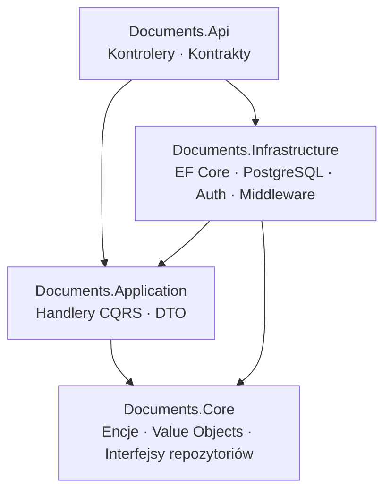
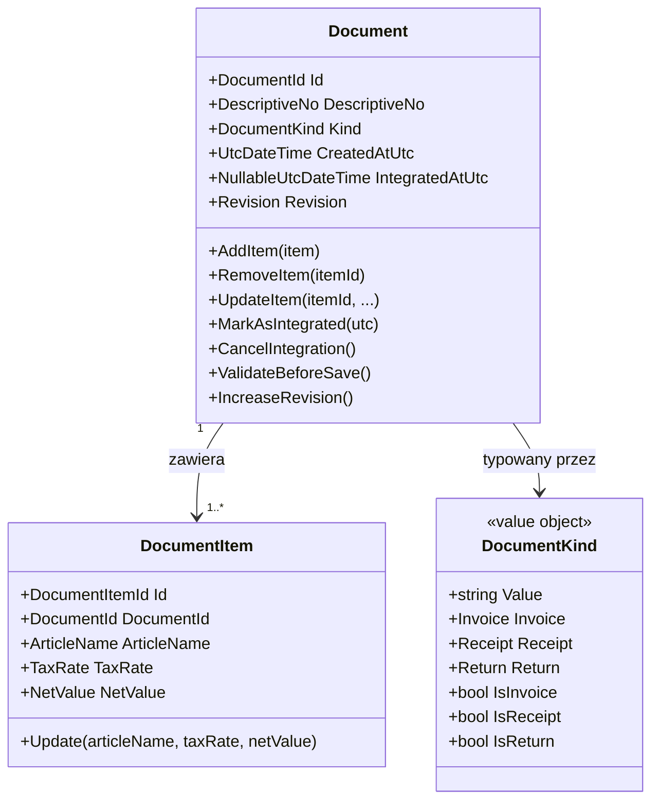
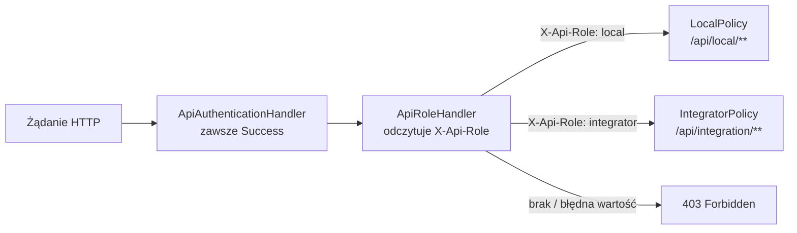
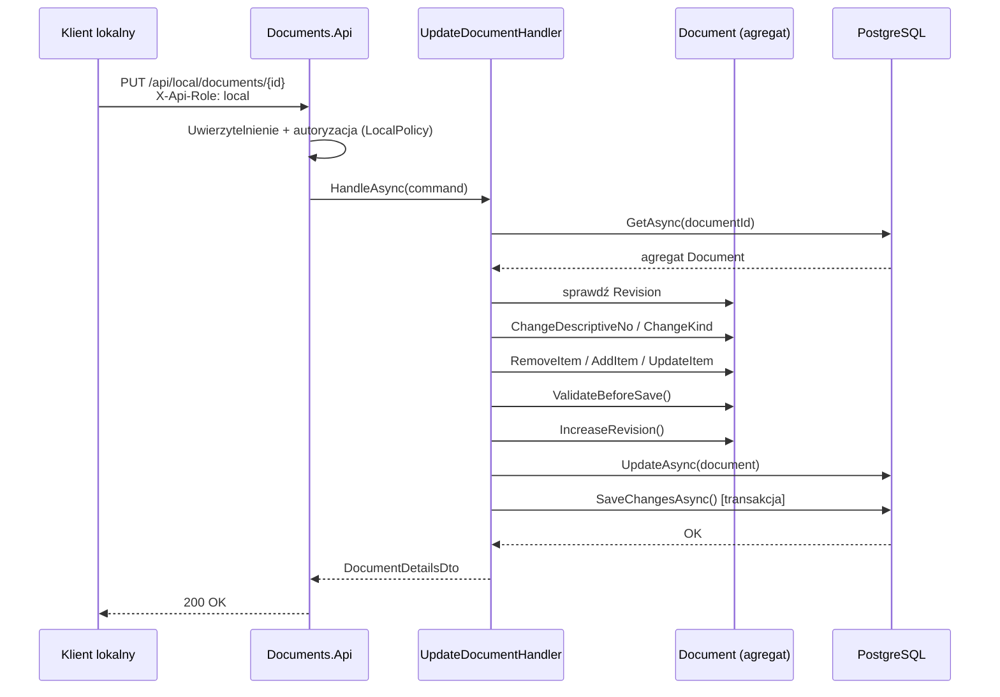
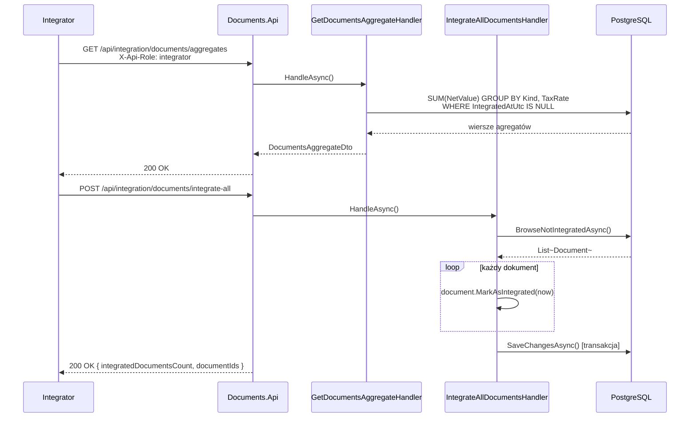

# Documents Service API

Backendowe API w .NET 9 realizujące **Podzadanie 1** zadania rekrutacyjnego: endpointy dla lokalnej aplikacji desktopowej oraz dla integratora.

---

## Architektura

Rozwiązanie stosuje Clean Architecture z podziałem na cztery projekty:



| Projekt | Odpowiedzialność |
|---|---|
| `Documents.Core` | Encje domenowe, value objects, zdarzenia domenowe, interfejsy repozytoriów |
| `Documents.Application` | Handlery CQRS, DTO, wyjątki aplikacyjne |
| `Documents.Infrastructure` | EF Core + PostgreSQL, migracje, autoryzacja, middleware |
| `Documents.Api` | Kontrolery ASP.NET Core, kontrakty żądań i odpowiedzi |

---

## Model domenowy



---

## Reguły biznesowe

- Dokument nie może zostać zapisany bez co najmniej jednej pozycji.
- Dla dokumentów typu `Return` wartość `NetValue` każdej pozycji musi być ujemna. Dla `Invoice` i `Receipt` — dodatnia. Egzekwowane w agregacie domenowym przez metodę `EnsureNetValueMatchesKind`.
- Dokument zablokowany do edycji po ustawieniu `IntegratedAtUtc`. Każda próba mutacji rzuca `CannotModifyIntegratedDocumentException` przez `EnsureEditable()`, wywoływane na początku każdej modyfikującej metody agregatu.
- Konflikty współbieżnych zapisów wykrywane są przez pole `Revision`. `PUT /api/local/documents/{id}` odrzuca żądanie, jeśli przesłana wartość `revision` różni się od przechowywanej — bez wykonania żadnej mutacji domenowej.
- Wszystkie zapisy dokumentu i pozycji wykonują się w ramach jednego wywołania `IUnitOfWork.SaveChangesAsync` (transakcja EF Core).

---

## Autoryzacja

Autoryzacja opiera się na nagłówku HTTP `X-Api-Role`. Mechanizm składa się z trzech elementów:

- `ApiAuthenticationHandler` — zawsze uwierzytelnia żądanie (tworzy `ClaimsPrincipal` z nazwą `api-client`). Brak weryfikacji klucza — tożsamość klienta ustalana jest wyłącznie przez rolę w nagłówku.
- `ApiRoleRequirement` / `ApiRoleHandler` — sprawdzają wartość nagłówka `X-Api-Role` i porównują ją z wymaganą rolą zdefiniowaną w polityce.
- Dwie polityki autoryzacji: `LocalPolicy` i `IntegratorPolicy`, przypisane do odpowiednich grup kontrolerów.



| Nagłówek | Wartość | Dostępne endpointy |
|---|---|---|
| `X-Api-Role` | `local` | `/api/local/**` |
| `X-Api-Role` | `integrator` | `/api/integration/**` |

---

## Endpointy API

### Lokalny klient — `[Authorize(Policy = "LocalPolicy")]`

| Metoda | Ścieżka | Opis |
|---|---|---|
| `GET` | `/api/local/documents` | Lista wszystkich dokumentów |
| `GET` | `/api/local/documents/{id}` | Szczegóły dokumentu wraz z pozycjami |
| `GET` | `/api/local/documents/{id}/integration-status` | Czy i kiedy dokument został pobrany przez integratora |
| `POST` | `/api/local/documents` | Utwórz dokument z pozycjami |
| `PUT` | `/api/local/documents/{id}` | Zastąp pola dokumentu i pełną listę pozycji |

`PUT` przyjmuje pole `revision`. Handler porównuje je z przechowywaną wartością — niezgodność zwraca HTTP 409 bez żadnej zmiany stanu.

`PUT` rozpoznaje tożsamość pozycji po polu `Id`. Pozycje z `Id = 00000000-0000-0000-0000-000000000000` traktowane są jako nowe i otrzymują nowy `Guid`. Pozycje istniejące w bazie, nieobecne w ciele żądania, są usuwane. Jeden endpoint obsługuje więc dodawanie, edycję i usuwanie pozycji w jednej transakcji.

### Integrator — `[Authorize(Policy = "IntegratorPolicy")]`

| Metoda | Ścieżka | Opis |
|---|---|---|
| `GET` | `/api/integration/documents/aggregates` | `SUM(NetValue)` w podziale na `Kind` × `TaxRate` dla niepobranych dokumentów |
| `POST` | `/api/integration/documents/integrate-all` | Oznacz wszystkie niepobrane dokumenty jako pobrane |
| `POST` | `/api/integration/documents/{id}/integrate` | Oznacz pojedynczy dokument jako pobrany |
| `DELETE` | `/api/integration/documents/{id}/integration` | Cofnij integrację (resetuje `IntegratedAtUtc` do null) |

Endpoint agregatu zwraca wszystkie dokumenty, gdzie `IntegratedAtUtc IS NULL` — realizuje tym samym zasadę „od ostatniego pobrania lub od początku". Wywołanie `integrate-all` atomowo ustawia `IntegratedAtUtc` dla wszystkich zwróconych dokumentów.

---

## Przepływ żądania



---

## Przepływ integracji



---

## Dokumentacja API

W trybie deweloperskim dostępne są dwa interfejsy dokumentacji:

- **Scalar** — `http://localhost:{API_PORT}/scalar/`
- **OpenAPI JSON** — `http://localhost:{API_PORT}/openapi/v1.json`

Nawigacja do `http://localhost:{API_PORT}/` przekierowuje do Scalar.

---

## Uruchomienie

### Wymagania

- Docker + Docker Compose

### 1. Utwórz plik `.env`

Utwórz plik `.env` w katalogu `docker/` z następującymi zmiennymi:

```env
POSTGRES_DB=documents
POSTGRES_USER=postgres
POSTGRES_PASSWORD=postgres
POSTGRES_PORT=5432

API_PORT=5109

PGADMIN_DEFAULT_EMAIL=admin@admin.com
PGADMIN_DEFAULT_PASSWORD=admin
PGADMIN_PORT=5050
```

### 2. Uruchom wszystko

```bash
docker compose -f docker/docker-compose.dev.yml up --build
```

Polecenie uruchamia trzy kontenery:

| Kontener | Opis | Domyślny port |
|---|---|---|
| `documents-postgres` | PostgreSQL 16 | `5432` |
| `documents-api` | API ASP.NET Core | `5109` |
| `documents-pgadmin` | pgAdmin 4 | `5050` |

Kontener API czeka na przejście health checku PostgreSQL przed startem. Migracje EF Core uruchamiają się automatycznie przy starcie aplikacji przez `app.Services.InitializeInfrastructureAsync()` — ręczne wywołanie `dotnet ef database update` nie jest wymagane.

### 3. Zatrzymanie

```bash
docker compose -f docker/docker-compose.dev.yml down
```

Aby usunąć również wolumeny (kasuje bazę danych):

```bash
docker compose -f docker/docker-compose.dev.yml down -v
```

---

## Uruchomienie testów

Testy integracyjne używają **Testcontainers** do uruchomienia rzeczywistego kontenera PostgreSQL na czas sesji testowej. Żadne zewnętrzne usługi nie muszą być uruchomione.

```bash
dotnet test src/Documents.Tests
```

Wymagany jest .NET 9 SDK oraz uruchomiony daemon Dockera.

---

## Kluczowe decyzje techniczne

**Jeden endpoint `PUT` dla dokumentu i pozycji.** Ciało żądania zawiera pełny docelowy stan dokumentu wraz z listą pozycji. Handler różnicuje stan z przechowywanym i wywołuje minimalny zestaw metod domenowych (`AddItem` / `UpdateItem` / `RemoveItem`). Granica transakcji jest jednoznaczna, brak możliwości częściowego zapisu.

**Współbieżność przez `Revision`.** Agregat udostępnia `IncreaseRevision()`, wywoływane na końcu każdego udanego zapisu. Klient odsyła wersję, którą ostatnio odczytał. Niezgodność jest odrzucana przed jakąkolwiek mutacją domenową.

**Blokada integracyjna w domenie.** `IntegratedAtUtc` jest value objectem (`NullableUtcDateTime`). `EnsureEditable()` wywoływane jest na początku każdej modyfikującej metody agregatu — blokada obowiązuje niezależnie od tego, która ścieżka warstwy aplikacyjnej jest użyta.

**Rehydracja agregatu bez zdarzeń.** `Document.Restore(...)` odtwarza dokument z bazy i wywołuje `ClearEvents()` po konstrukcji. `Document.Create(...)` jest jedyną ścieżką, która podnosi `DocumentCreated`.

**Autoryzacja przez `X-Api-Role`.** `ApiAuthenticationHandler` zawsze uwierzytelnia żądanie (nie weryfikuje klucza). `ApiRoleHandler` odczytuje nagłówek `X-Api-Role` i porównuje jego wartość z rolą wymaganą przez `ApiRoleRequirement`. Dwie polityki (`LocalPolicy`, `IntegratorPolicy`) separują grupy kontrolerów. Brak JWT, sesji ani ciasteczek.